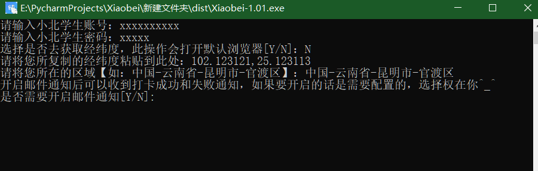
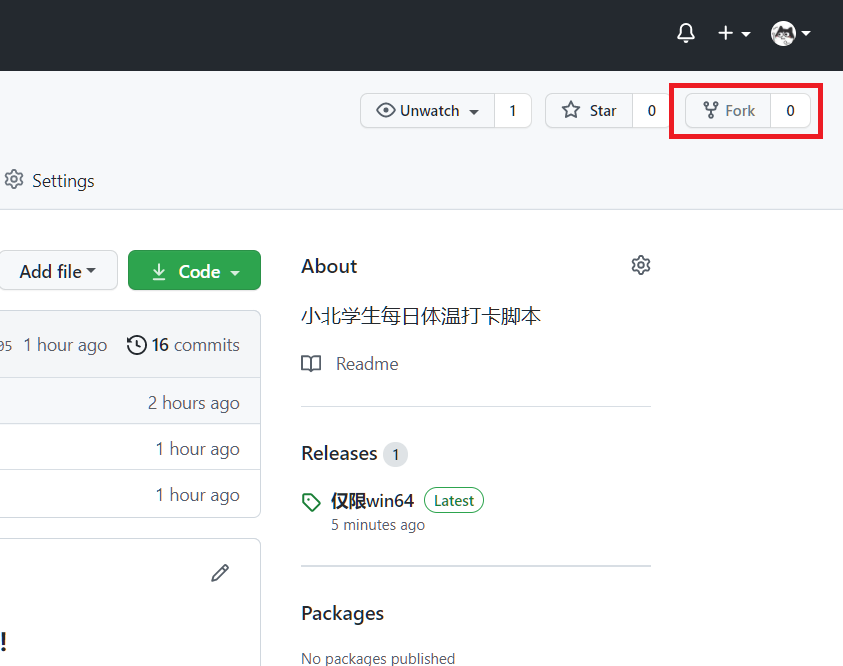
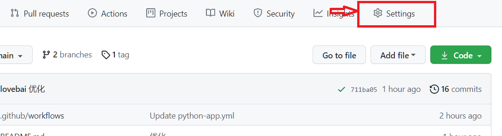
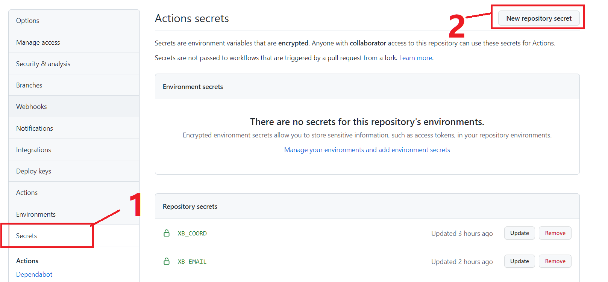
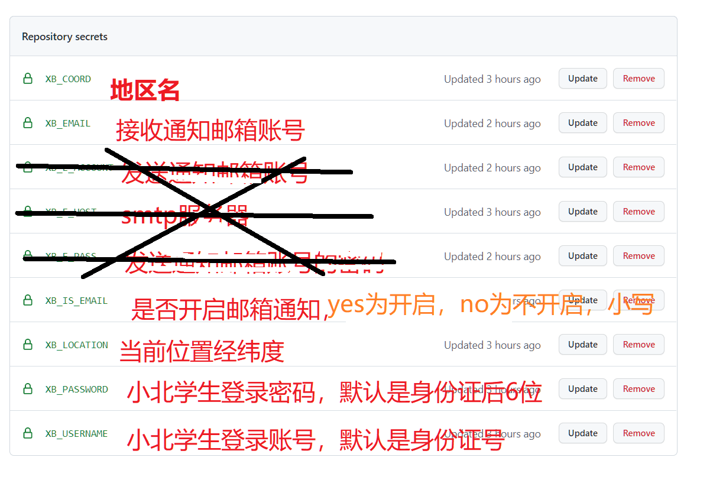
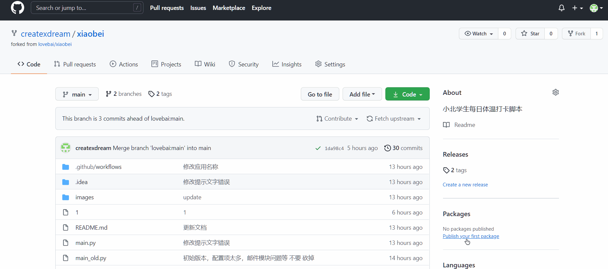
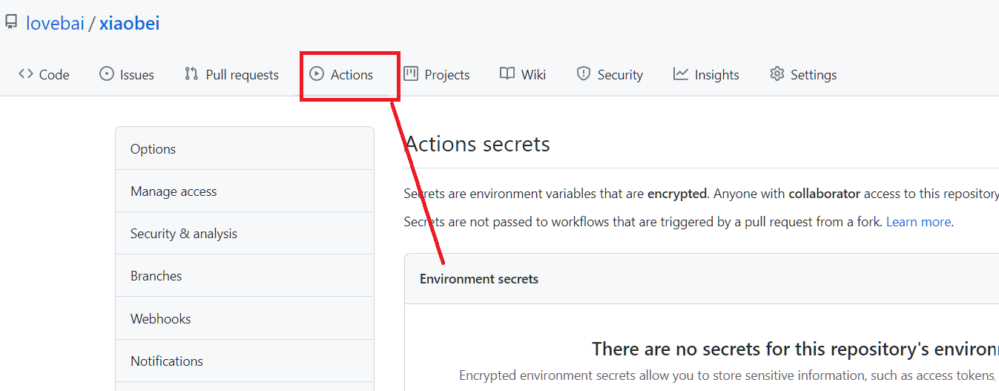
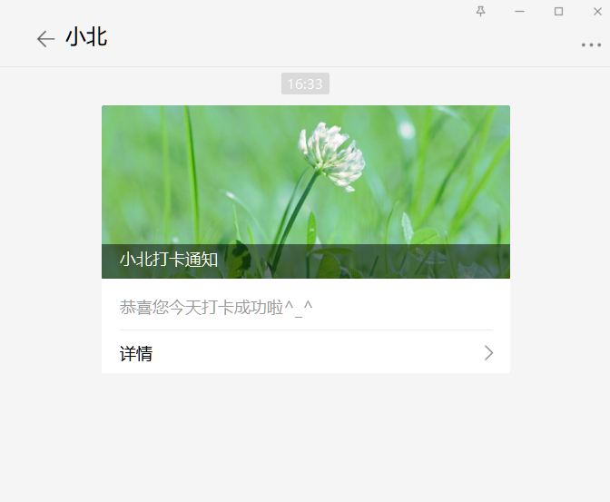

## 本项目主要用于学习研究，请勿用于非法用途，若出事一切后果请自行承担！本人概不负责，谢谢！

### 介绍

> 这是一个小北学生自动打卡脚本，用了此脚本导员再也不用在群里一直@你了，不用为了每天忘记打卡而想各种理由了，这玩意之前就想就想搞一个了，只不过没时间好好看一下，之前使用小米手机抓包一直有问题，最近用iPhone抓 却抓到了
> 这个脚本是在我上班摸鱼期间写的，带薪摸鱼🐟  真的很舒服~~

**该仓库基于[@lovabai](https://github.com/lovebai/xiaobei)的代码进行了一定的修改，支持了多用户打卡功能**

### 使用

---

**有两种方法使用，一种是使用 `Github actions` ，使用这种方法的前提是需要有一个GitHub账号，没有的话就注册一个，大概流程就是登录账号后Fork本项目到自己仓库，然后创建Secret，用于项目的环境变量，这个secret不会直接暴露出来的，可放心填写，记得去设置一下 `Actions permissions`,然后开启仓库的工作流即可，还有一直是直接在本地运行（但是当前主分支不推荐，可以使用dev分支），当前分支是通过是否存在环境来判断是否需要输入各种信息的，具体的自行下载看看呗，还有一点就是 `Github Actions`由于负载等原因会存在一些延迟**

考虑到本地smtp邮箱设置的问题，已经更换为接口方式，本地无需在进行发送端的配置了，只要填个邮箱就可以了，关于微信通知server酱的问题看底部

**如果对仓库没有操作Github action 会在60天内自动停止，需要重新打开流水线功能**

#### 本地运行

---

安装python3环境，然后执行 `pip install requests`或者 `python -m pip install requests`,之后下载本仓库代码，如果安装了Git则直接使用命令 `git clone https://github.com/lovebai/xiaobei.git`
如果未安装则直接在右上角下载zip，如图


还有种情况是未安装python环境和git环境的直接在 `release`中下载exe，下载链接：[Release Download](https://github.com/lovebai/xiaobei/releases/tag/1.0.2)



---

#### 在Github Actions运行方式（推荐使用这种）

---

##### 首先点击右上角的Fork



##### Fork成功后点击 `settings`



##### 为了安全，选择和下图一样的,右侧栏 `actions`


##### 还是右侧栏，选择 `secrets`



##### 根据下图 添加配置



为了方便复制也提供一份文本的

```xml
XB_USERNAME  
XB_PASSWORD  
XB_LOCATION 
XB_COORD   # 可选 如果打卡位置出现问题 就填写该项
XB_EMAIL  # 可选
XB_WXAPP # 可选
XB_SENDKEY #可选
```

参数介绍

- XB_USERNAME  # 小北用户名（必填）
- XB_PASSWORD  # 小北密码（必填）
- XB_LOCATION    # 经纬度（必填）获取地址：[https://api.xiaobaibk.com/api/map/](https://api.xiaobaibk.com/api/map/)
- XB_COORD        # ~~当前位置（~~必填~~）列如【中国-云南省-昆明市-官渡区】~~ 新版本可不填 会通过接口获取
- ~~XB_IS_EMAIL      # 是否开启邮件通知（必填）如果开启则填入yes关闭则填no,必须小写，开启了下面的也必填 不然收不到信息~~
- XB_EMAIL          # 通知接收邮箱账号（可选）不填则不发送通知
- XB_WXAPP          # 企业微信key（可选）不填则不发送通知 获取方法：[点我](wxapp.md)
- XB_SENDKEY        # server酱通知方式 ，获取server酱密钥：[https://sct.ftqq.com/](https://sct.ftqq.com/)

下面是添加账号的示例，其他的也按此方法填写即可


##### 看下面的地图操作，不要只是填图中那几项，上面给的都是必填的




##### 完成之后点 `code`回到代码页然后点add file在点击create new file




##### 点击后标题和内容随便输入，输好之后直接点击Commit new file


##### 之后在前actions查看任务即可


##### 跟随主仓库更新项目


### 说明

---

- 以上说明只是起初版本的
- 有时间会优化的
- ~~需要配置的东西有点多，后期会将邮件给优化了 换一种方式通知或者调用接口的方式~~
- 持续优化
- 已经将本地SMTP发件方式换成了调用接口方式发送，所以只需要填个收件邮箱即可
- 如果有需要server酱的可自行二开，加个函数就完事了，由于需要关注公众号我就不搞了，提供个链接：[https://sct.ftqq.com/](https://sct.ftqq.com/ "https://sct.ftqq.com/") 当然还有QQ的，我本人不怎么用QQ所以也没考虑🤣，提供个链接：[https://qmsg.zendee.cn/](https://qmsg.zendee.cn/ "https://qmsg.zendee.cn/")（免费）
  如果微信绑定了邮箱，用邮箱也是挺方便的

---

### 新版介绍

可支持发送企业微信通知，不过获取key步骤有点多，用起来还是挺不错的
通知参数可选，填写则通知，不填则不通知，邮件也是一样
食用方法请看：[wxapp.md](wxapp.md)
通知样式



如果需要，telegram也可以整上，需要的提个issue

##### 其他

整体改了点，重复造轮子，从之前每天打卡一次设置成了一天两次，以防小北打卡系统出现问题，嗯 就这样

### 其他

---

> 如果你自己有服务器的话建议使用dev版本，在本地使用也是可以的，各有各的好处吧，
> [点我去看服务器版本](https://github.com/lovebai/xiaobei/tree/dev)

### 免责声明

---

本项目只做为技术研究，本人不对其程序所带来的后果担则。
