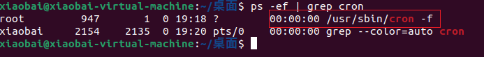
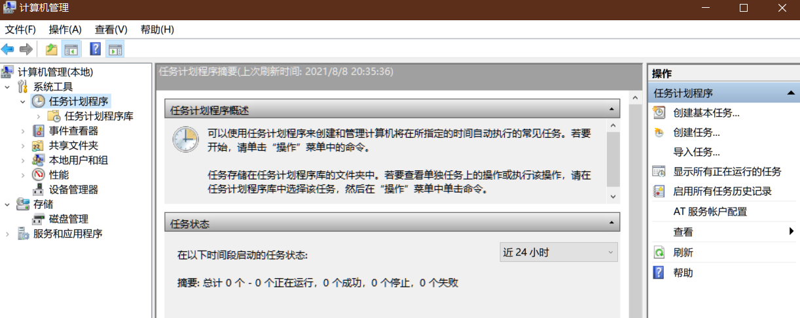
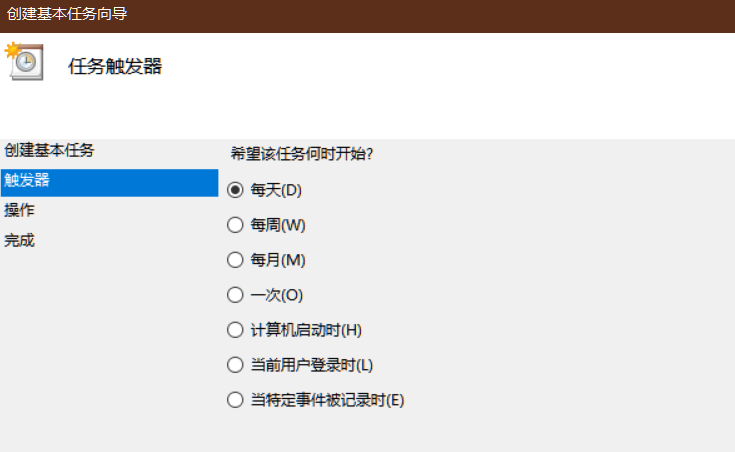
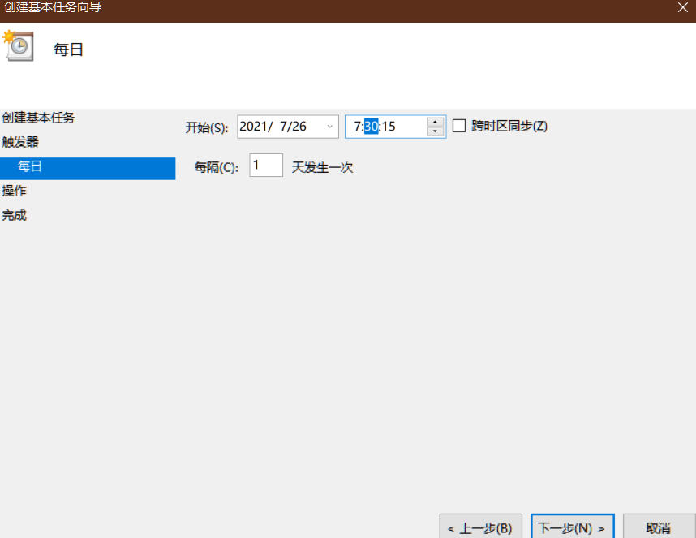
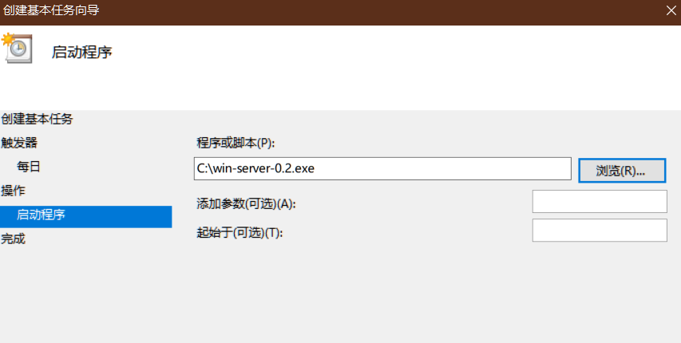

## 本项目主要用于学习研究，请勿用于非法用途，若出事一切后果请自行承担！本人概不负责，谢谢！

### 介绍

> 这个是dev分支,主要实现方法还是一样的 只不过换了个方式，相对主分支这个版本用在服务器上可能更好一点。
>
> 这个版本呢会在当前程序目录下创建一个 `config.conf ` 文件，后期运行时便是通过此文件来判断是否需要添加信息什么的。

如果你没有自己的服务器的话还是使用主分支上提供的方法吧，当然你电脑从来不关的话就就当没看到这句话，按照下面win server设置方法设置吧

---

不要忘了随手点个star哦

### 使用方法

**不管在那个平台，第一次打开都要填写信息。如果需要修改信息比如修改位置什么的就把配置文件删除了出现打开即可重新填写**

免费提供邮件通知服务，只需填写接收邮箱即可

##### Ubuntu

如果你的服务器安装了Python3和Git则可以直接依次运行下面的脚本，你没有安装但是就想用python脚本，那就自己上百度找安装教程，选择权在你

下载仓库代码

```shell
git clone -b dev https://github.com/lovebai/xiaobei.git
```

安装requests依赖

```shell
pip install requests
#或者 
python -m pip install requests
```

首次运行

```shell
python3 ./main.py
```

然后去添加计划任务

查看cron是否运行

```shell
ps -ef | grep cron
```

如果不显示cron -f则说明未运行，通过以下命令启动

```shell
sudo service cron start
```



编辑crontab文件，用来存放你要执行的命令

```shell
sudo crontab -e
```

第一次用这个命令，会让你选择文本编辑器，直接选默认的vim就可以了

添加执行命令

```shell
0 7 * * *  /home/xiaobai/main.py
```

上面这个的意思是每天7点定时运行用户xiaobai目录下的main.py,这里这个路径一定不要写错哈，要填自己的路径地址

重启cron来应用这个计划任务

```shell
sudo service cron restart
```

或者你的服务器没有安装任何环境，可以直接在Release中下编译好的[Xiaobei-server-ubuntu-1.0](https://github.com/lovebai/xiaobei/releases/download/1.0.2/Xiaobei-server-ubuntu-1.0)，这个就不需要安装python3和Git了

首次运行在程序目录直接输入即可

```shell
./Xiaobei-server-ubuntu-1.0
后面的步骤和上面的一样
 # 查看cron是否运行
ps -ef | grep cron
 # 如果不显示cron -f则说明未运行，通过以下命令启动
sudo service cron start
  # 编辑crontab文件，用来存放你要执行的命令
sudocrontab -e
  # 第一次用这个命令，会让你选择文本编辑器，直接选默认的vim就可以了
  # 添加执行命令
0 7 * * *  /home/xiaobai/Xiaobei-server-ubuntu-1.0
  # 上面这个路径也不能错
  # 重启cron来应用这个计划任务
sudo service cron restart
```

---


##### Centos

Centos版本的没有编译，请直接下载安装python3和Git,安装命令这里就不提供了，自行百度

步骤：


下载仓库代码

```shell
git clone -b dev https://github.com/lovebai/xiaobei.git
```

安装requests依赖

```shell
pip install requests
#或者 
python -m pip install requests
```

首次运行

```shell
python3 ./main.py
```

然后去添加计划任务

```shell
yum install crontabs  #安装crontabs
systemctl enable crond #设为开机启动
systemctl start crond #启动crond服务
systemctl status crond  #查看状态
```

设置用户自定义定时任务

```shell
vi /etc/crontab
```

然后在底部添加执行脚本

```shell
0 7 * * *  root  /home/xiaobai/main.py
```

这里的7还是表示早上7点,如果不使用国际标准时间就不会出错，保存退出

加载任务,使之生效

```shell
crontab /etc/crontab  
```

查看任务

```shell
crontab -l
```

---


##### Win Server

在release页面下载[win-server-0.2](https://github.com/lovebai/xiaobei/releases/download/1.0.2/win-server-0.2.exe)，之后把它放到c盘下，放哪都可以只为了好记路径，然后双击进行首次运行，之后就是去设置计划任务

下面时Windows server2003的设置步骤，别的版本也差不多

1.打开控制面板

2.打开任务计划

3.添加任务计划

4.任务计划向导

5.选择需要运行的程序

6.浏览文件，选择win-server-0.2.exe

7.选择执行时间

8.修改起始时间

9.输入服务器密码

10.勾选复选框，点击完成

11.属性页面，点击日程安排

12.设置任务每天开始时间

13.点击高级选项，设置任务重复时间点击确认，完成任务计划设置











### 免责声明

---

本项目只做为技术研究，本人不对其程序所带来的后果担则。
