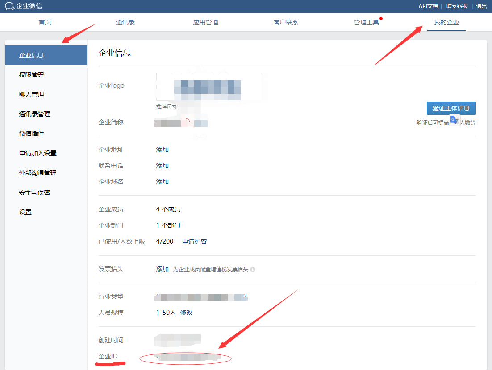
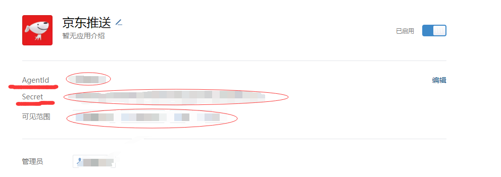
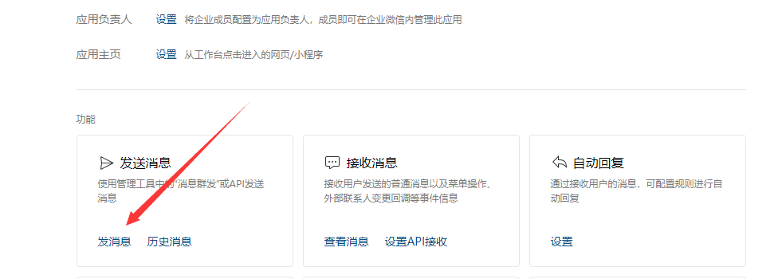
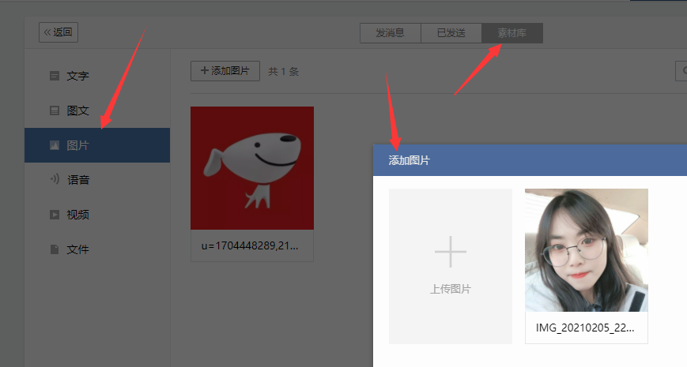
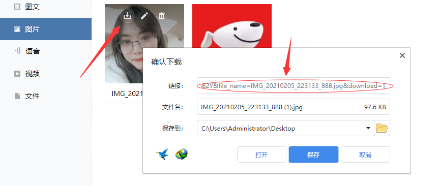
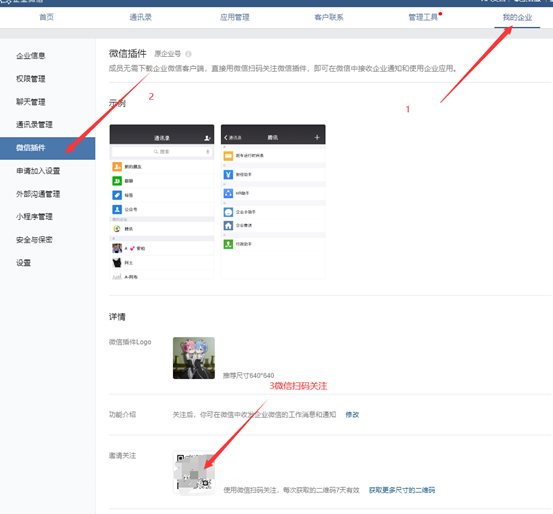

第一个值是企业id，第二个值是secret，第三个值@all(或者成员id)，第四个值是AgentID，第五个值是图片id  中间以逗号隔开

最终格式例：

```
ww479cadfqfe8c151f,MPKN9gX97w4e4b4h4u7u4i4i4i4iO6mN_dDedBFzqC5c,@all,1000002,2S8H-JWEdsadFDSFSDDijbrtkldfhjslafhs5zEU1GyUkU
```

最终将此密钥填入环境变量 `XB_WXAPP`中，如果下载的是可执行的则直接输入即可

1. 扫码进入企业微信后台，获取企业id

[https://work.weixin.qq.com/wework_admin/loginpage_wx](https://work.weixin.qq.com/wework_admin/loginpage_wx)



2.依次进入应用管理-应用-自建-创建应用，自己创建完成后获取secret和AgentID和成员id

前两个直接填，如果给所有人推送填@all(这里的所有人指的是已经添加到可见范围内的成员)，如果指定某个接收者直接填id



3.点击自建应用下方的发消息，依次选择素材库-图片-添加图片，上传完成后从下载库下载图片复制下载链接，然后图片id只需要填写下载链接中粗体的部分。

例：

https://work.weixin.qq.com/wework_admin/material/getOpenMsgBuf?type=image&media_id=**28If78oLlSULBeKTvSK8-B6LtFJbc_JWwV2JSou6bftKVmpxyWA1kgU8bB2Y**&file_name=IMG_20210205_223133_888.jpg&download=1







补充

1.推送到普通微信，需要扫一下这个



2.推送给多人必须邀请其他人也加入企业，加入到应用可见范围中，也需要扫码微信插件。

3.一切以官方API为准：https://work.weixin.qq.com/api/doc/90000/90135/90235
